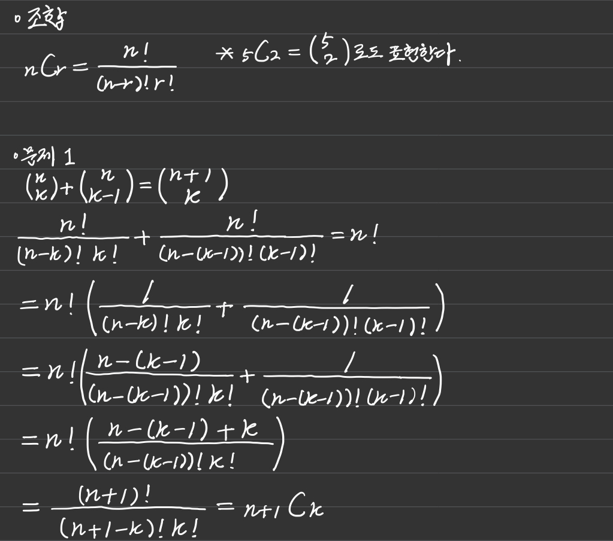
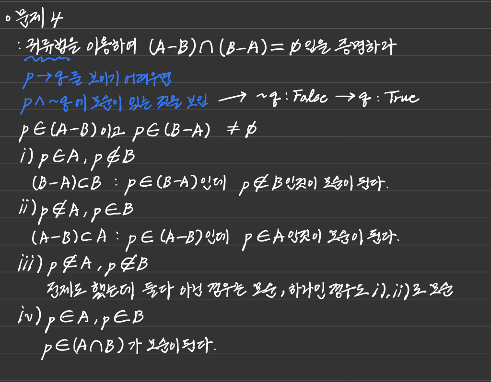
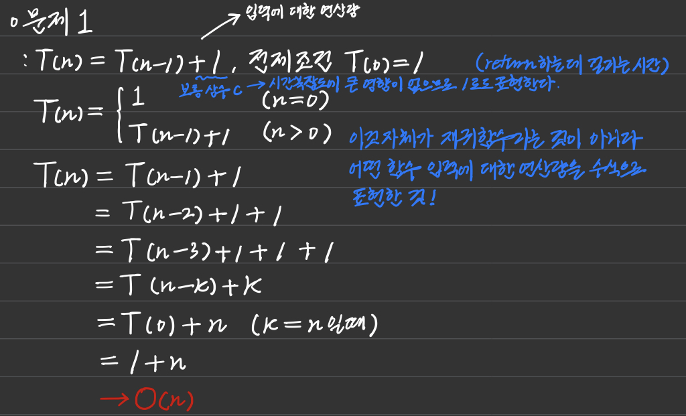
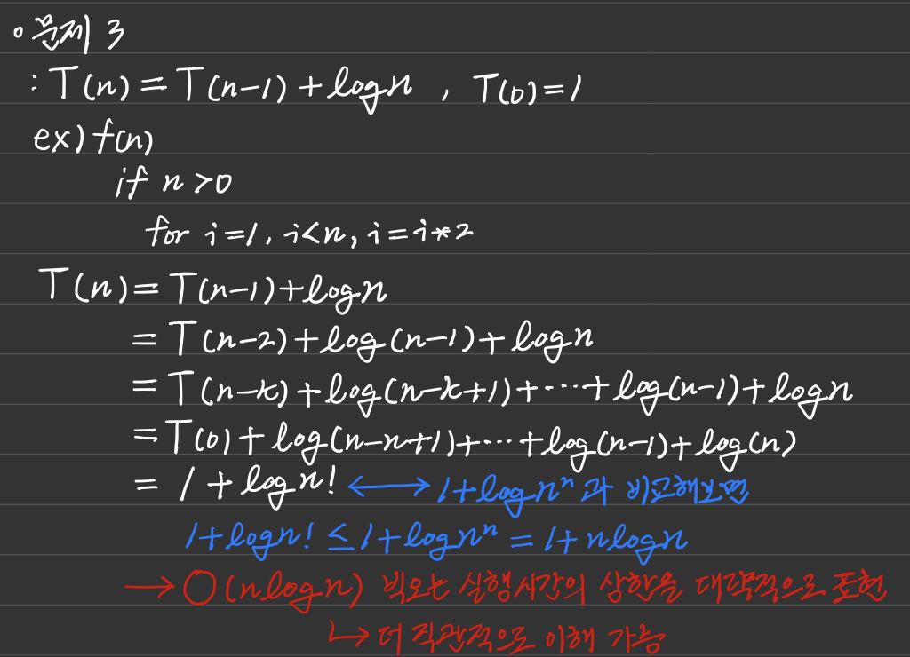
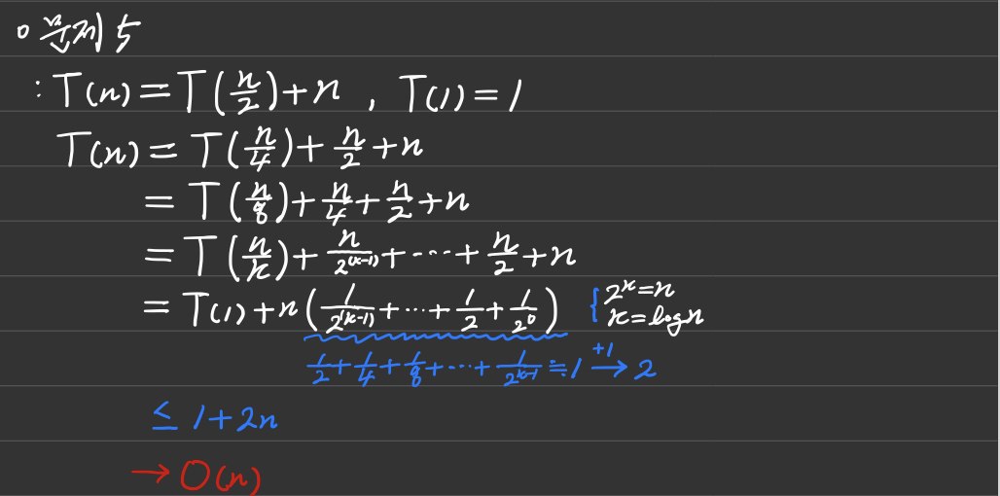
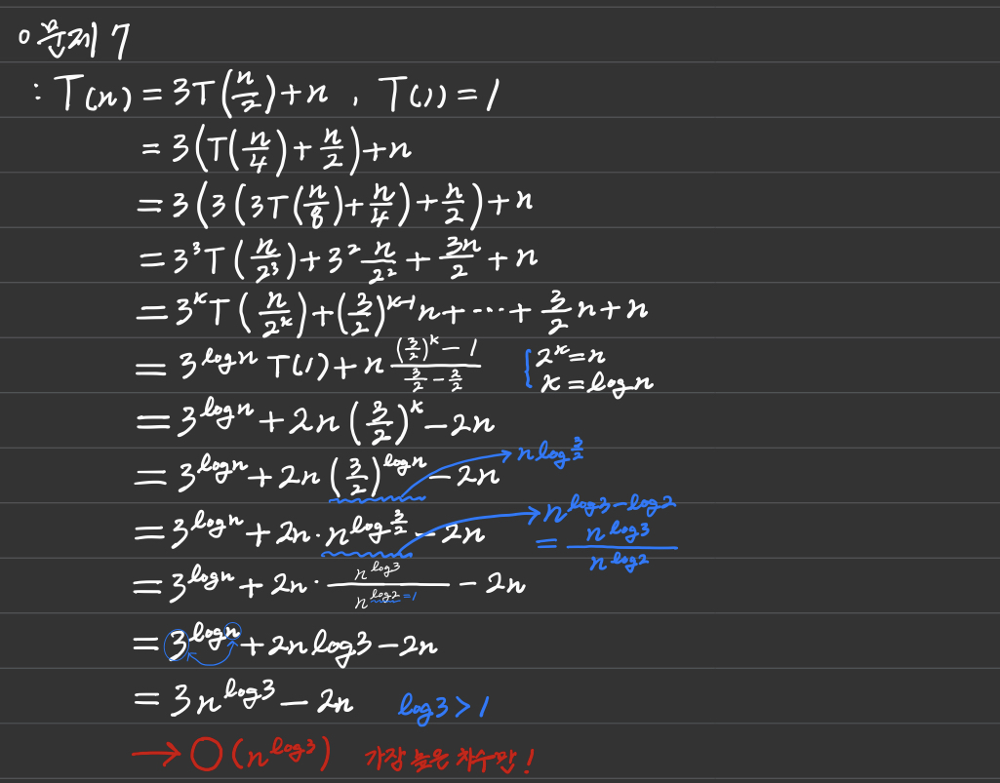
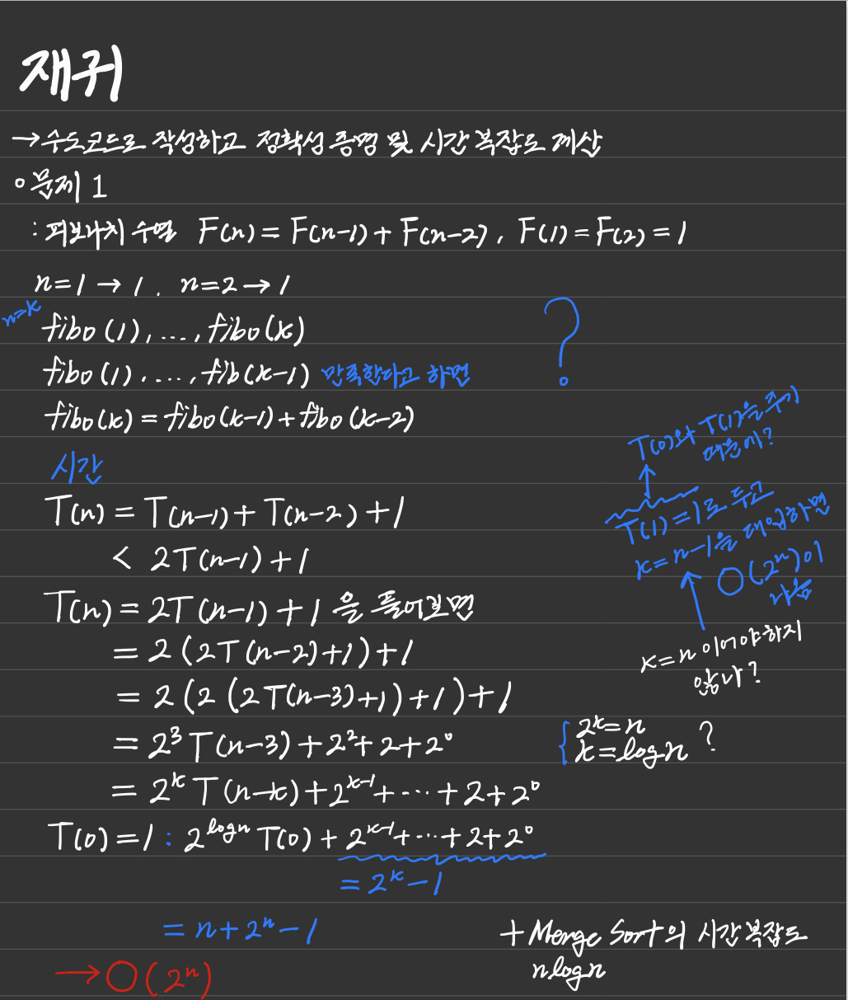

# Computing Thinking

`04.07`

## 명제

- 참이나 거짓을 알 수 있는 식이나 선언적 문장
- p, q, r로 표현
- 진릿값
  - 참이나 거짓을 표현
  - T, F 또는 1, 0

### 정의

> - 부정 NOT
>   - p가 명제일 때, 명제의 진릿값이 반대
>   - ~p나 ㄱp로 표기 (not p 또는 p의 부정으로 읽음
> - 논리곱 AND
>   - p, q가 명제일 때, p, q 모두 참일 때만 참이 되는 명제
>   - p∧q (p and q, p 그리고 q)
> - 논리합 OR
>   - p, q가 명제일 때, p, q 모두 거짓일 때만 거짓이 되는 명제
>   - pVq(p or q, p 또는 q)
> - 배타적 논리합 XOR
>   - p, q가 명제일 때, p, q 하나만 참일 때 참이 되는 명제
>   - pㄱq(p xor q)

### 합성

> - 연산자 우선 순위
>   - ㄱ>V, ∧ > →, ↔
> - 항진명제 : 진릿값이 항상 참
> - 모순명제 : 진릿값이 항상 거짓
> - 사건명제 : 항진명제도 모순명제도 아닌 명제

### 조건명제(정의)

> - p, q가 명제일 때, 명제 p가 조건(또는 원인), q가 결론(또는 결과)로 제시되는 명제
>
> - p → q (p이면 q이다.)
>
>   - p  q    p → q
>   - T   T        T
>   - T   F         F
>   - F   T         T
>   - F   F         T
>     - 가정이 거짓이면 뒤에 있는 것이 의미가 없어진다를 T로 보는 것
>
>   ```python
>   ex) 참, 거짓 판단
>   
>   1) 만약 0이 홀수라면, 미국에서 2080년 월드컵이 열린다.
>   	F ? -> T
>   
>   2) 만약 19893827938274839이 Prime Number라면, 2는 짝수이다.
>   	? T -> T
>   ```

### 쌍방조건명제(정의)

> - p, q가 명제일 때, 명제 p와  q가 모두 조건이면서 결론인 명제
> - p ↔ q (p면 q고, q면 p다.)
> - p  q     p ↔ q
> - T   T         T
> - T   F          F
> - F   T          F
> - F   F          T

### 조건명제의 역, 이, 대우

> - 역 : p → q
> - 이 : ㄱp → ㄱq
> - 대우 : ㄱq → ㄱp
> - **조건명제와 조건명제의 대우의 진릿값은 같다!**

### 증명

> - 정확한 명제식으로 표현할 수 있는 것이어야 함
> - 보통은 정확한 명제식까지 쓰지는 않으나 근본적으로 명제식으로 바꿀 수 있음
> - 증명에 대한 수많은 오해가 p → q를 p ↔ q와 혼동하는 것에서 일어남
>
> #### Trivial Proof
>
> - 모든 x에 대하여 P(x) → Q(x)를 증명하려는데 Q(x)가 항상 참인 경우
>
>   ```python
>   1) 실수 x에 대해, 만약 x < -1이면 x^2 + 1/4 > 0이다.
>   2) n이 홀수이면 4n^3 + 6n^2 +12는 짝수이다.
>   ```
>
> #### Vacuous Proof
>
> - 모든 x에 대하여 P(x) → Q(x)를 증명하려는데 P(x)가 항상 거짓인 경우
>
>   ```python
>   1) 실수 x에 대해, 만약 2x^2 -4x + 4 < 0이면 x > 8이다.
>   2) 4n^3 + 6n^2 + 11이 짝수이면 n이 홀수이다.
>   ```

<br>

## 수와 표현

- 컴퓨터는 0/1을 표현할 수 있는 비트들을 모아 수를 표현
- k개의 비트를 사용하면 0부터 2^k - 1까지 표현 가능
  - 약속한 방식에 따라 다르지만, 어떤 경우든 최대 2^k가지의 값을 표현하는 것이 가능
- 어떤 값 n을 표현하기 위해서 필요한 비트의 수
- 2^k -1 ≥ n이 성립해야한다 → 즉, 2^k ≥ n + 1
- 같은 의미로, k ≥ log(n+1) → 약 logn비트가 필요
- x = logn과 2^x = n은 같은 말

### logn

> - 2의 몇 승이 n이 되느냐의 답
> - n을 표현하는 데 몇 비트가 필요한가의 답
> - 1로 시작해서 계속 두배를 할 때 몇 번 하면 n이 되느냐의 답
> - n을 2로 계속 나눌 때 몇 번 나누면 거의 1이 되느냐의 답
> - x = logn일 때 x와 n을 비교하면 x가 더 작고, n이 커질수록 엄청나게 달라진다.
> - 컴퓨터 분야에서 로그의 밑은 항상 2
> - n의 증가율보다 x의 증가율이 훨씬 낮다
> - 2의 x승을 해야 n이 나온다 : x = logn

### 추가 지식

> - 32비트 컴퓨터의 주소 공간은 2^32 = 약 40억개 주소(40억 byte)
>   - 32bit, 64bit 등은 다룰 수 있는 메모리 크기를 의미
>   - 기본적으로 주소는 바이트 단위

<br>

## 집합과 조합론

- 두 집합 A와 B에 대해 A가 B의 부분집합임을 증명한다는 것은 A의 임의의 원소가 B에 포함됨을 보이는 것과 같다.

  - ex) 모든 4의 배수는 2의 배수라는 것을 증명하려면, 4k = 2(2k)임을 보이면 된다.

- 두 집합 A와 B가 같다는 것을 증명하기 위해서는 A가 B의 부분집합이고 B가 A의 부분집합임을 증명하면 된다.

  ```python
  ex) A = {x | x = 2k + 1, k는 자연수}, B = {x | x = 4k + 1 혹은 x = 4k + 3, k는 자연수}
  - A에 포함되는 x = 2k + 1
  - k가 짝수인 경우와 홀수인 경우로 나눔
  - i) 짝수인 경우
      - x = 2k + 1 = 2(2k) + 1 = 4k + 1로서 x는 B에 포함됨
  - ii) 홀수인 경우
      - x = 2k + 1 = 2(2k + 1) +  = 4k + 3로서 x는 B에 포함됨
      - 모든 가능한 경우에 x는 B에 포함됨
  - B가 A의 부분 집합이다
  
  # 두 가지 증명에서 집합 A와 B는 같다.
  ```

### 조합

> - nCr
>
>   

### 예시 문제

> - 예시
>
>   

<br>

## 기초수식

- 알고리즘의 시간 복잡도를 표현하고 풀이법을 통해 시간 복잡도를 계산할 수 있다.

### 예시

> - ex. 1
>
>   
>
> - ex. 2
>
>   
>
> - ex. 3
>
>   
>
> - ex. 4
>
>   

<br>

## 재귀

- 자기 자신을 호출하는 함수
  - 함수 : 어떤 문제를 해결하는 방법을 코딩한 것
- 코드의 모양만 똑같고 다른 함수라고 생각 !
- 메모리를 다른 곳을 씀, 메모리에 들어가는 값을 기준으로 생각!
- 수학적 귀납법 증명 사용 가능
  1. n이 0일 때 문제를 풀 수 있음
  2. n -1에서 문제를 풀 수 있으면 n에서도 문제를 풀 수 있다.
  3. 위 두 가지가 사실이면 모든 가능한 n에 대해 문제를 풀 수 있다!

### 예시

> - ex. 1 → n = k-1이 들어가는 것이 맞는듯..?
>
>   

<br>

## 동적 프로그래밍

### Memoization

> - 재귀 함수에서 동일한 입력의 함수 호출이 반복적으로 일어날 때 그 결과 값을 저장해 두고 불러 쓰는 것
> - 최초 입력에서 파생되는 모든 가능한 입력에 대한 답을 저장할 수 있는 메모리가 있어야 한다.

### Dynamic Programming

> - 단순히 재귀에서 저장된 값을 찾아보는 것으로도 가능하지만, 결과 값을 순서를 정해서 계산한다.

<br>

## 시간 복잡도

- 알고리즘 A → 시간함수 → f(n)
- A의 최악의 시간복잡도 : O(n^2)라고 하면 f(n) ∈ O(n^2)

<br>

`04.08`

## 병합 정렬(Merge Sort)

- 여러 개의 정렬된 자료의 집합을 병합하여 한 개의 정렬된 집합으로 만드는 방식

  - 두 개를 합쳐서 하나로 만듦
  - n/2

- 분할 정복 알고리즘 활용

  - 자료를 최소 단위의 문제까지 나눈 후에 차례대로 정렬하여 최종 결과를 얻어냄
  - top-down 방식

- 시간 복잡도 : O(nlogn)

- 2개의 부분 집합을 정렬하면서 하나의 집합으로 병함

  - n개의 부분 집합이 1개로 병합될 때까지 반복함

- Python 스타일

  ```python
  def mergeSort(lst):
      if len(lst) <= 1: return lst  # 길이가 1이면 더이상 분할해 줄 필요가 없음
  
      # 분할 하기
      mid = len(lst) // 2
      l = mergeSort(lst[:mid])
      r = mergeSort(lst[mid:])  # 이렇게 하면 안좋지만 개념을 이해하려고 씀
  
      # 병합 하기
      result = []  # 하나씩 비교해서 작은 것을 집어 넣을거임!
      while len(l) and len(r):
          if l[0] < r[0]:
              result.append(l.pop(0))
          else:
              result.append(r.pop(0))
  
      if len(l): result.extend(l)
      else: result.extend(r)
  
      return result
  
  
  
  arr = [69, 10, 30, 2, 16, 8, 31, 22]
  
  sorted_lst = mergeSort(arr)
  print(sorted_lst)
  ```

- C 스타일

  ```python
  arr = [69, 10, 30, 2, 16, 8, 31, 22]
  tmp = [0] * len(arr) # 원본 크기와 같은 공간을 만듬
  
  def mergeSort(s, e):
      if s == e: return  # 범위에 해당하는 자료가 한개밖에 없을 때
  
      # 분할 하기
      mid = (s + e) // 2
      mergeSort(s, mid)
      mergeSort(mid + 1, e)  # 이렇게 하면 안좋지만 개념을 이해하려고 씀
  
      # 병합 하기
      i, j, k = s, mid + 1, s  # 임시변수를 설정 / s, e 값이 하는 도중에 변하면 안되니까 / k는 tmp의 인덱스 변수
  
      while i <= mid and j <= e:
          if arr[i] < arr[j]:
              tmp[k] = arr[i]
              i, k = i + 1, k + 1
          else:
              tmp[k] = arr[j]
              j, k = j + 1, k + 1
  
      while i <= mid:
          tmp[k] = arr[i]
          i, k = i + 1, k + 1
      while j <= e:
          tmp[k] = arr[i]
          j, k = j + 1, k + 1
  
      for i in range(s, e + 1):
          arr[i] = tmp[i]
          # 지금은 전역변수로 잡았는데 원래는 내부에서 만들어서 사용 / C언어 같은 경우는 배열도 같이 함수로 넘겨주고 마지막에 정렬된 배열을 돌려줌
  
  
  mergeSort(0, len(arr) - 1)
  print(arr)
  ```

