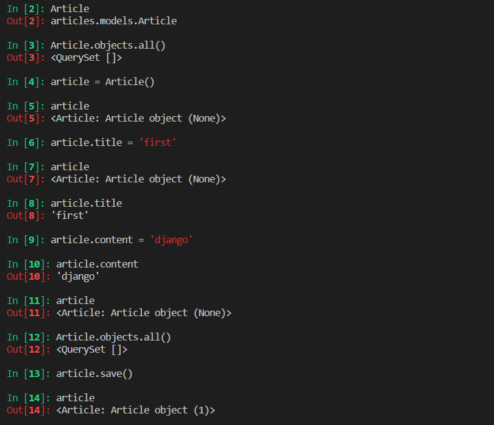
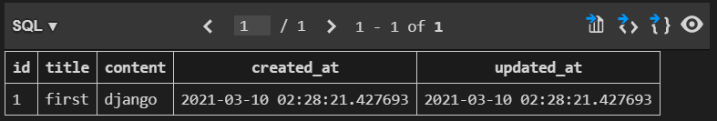
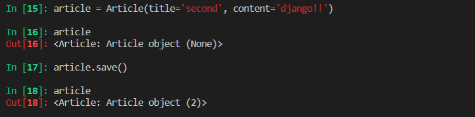
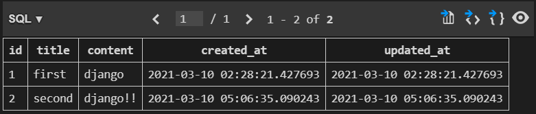
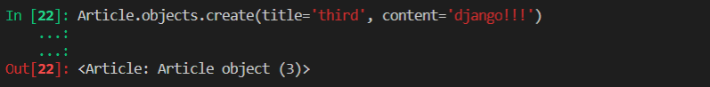
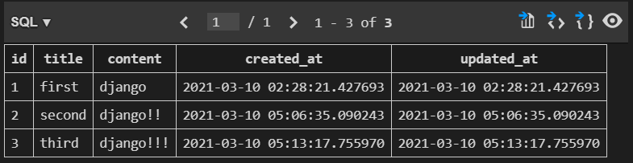
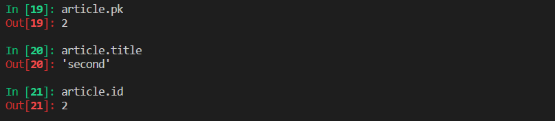

# Django

``03.08``

: Dynamic Web Application Program

- Static web
  - 미리 저장된 정적 파일(HTML, CSS, JS)을 제공
  - 서버에 사용자에게 보여질 것들이 미리 준비가 되어있고 사용자 요청이 들어오면 그대로 보여줌
- Dynamic web
  - 사용자에게 보여지는 클라이언트 사이드는 구현되어있고, 사용자 요청에 따라 서버 사이드쪽에서 일을 하여 다른 데이터를 만들어서 보여주는 것
  - 웹사이트에서 요청을 받았을 때, 서버는 추가적으로 무언가 일을 해서 클라이언트로 답장을 보내주는 것
  - 사용자 요청에 따라서 뒷단에서 일을 하여 보여준다고 이해!
  - 서버사이드 프로그래밍 언어들 즉, 우리가 일반적으로 알고 있는 언어들이 사용되고 그 언어들이 SQL이라고 하는 데이터베이스 언어를 통해서 데이터베이스 처리를 한다. 그 데이터들을 다시 잘 가공하여 클라이언트로 보여주는 것을 Dynamic website
  - 이런 Dynamic website를 만들어주는 framwork가 django
- 클라이언트(우리) : 브라우저를 통해서 돌아다니는데, naver의 sever에 메인페이지를 보내달라고 요청을 보냄  → 응답으로 naver에 대한 웹페이지 문서를 줌
- 웹의 프로토콜은 요청과 응답이 전부
- 서버단에서 운영되는 것을 django를 통해서 구축할 것임 - 요청을 받아서 응답을 보내는 서버 구축!

<br>

## django 동작

- web framework 
  - 웹페이지를 개발하는 과정에서 겪는 어려움을 줄이는 것이 주 목적
  - 기본적인 구조과 코드들을 기본적으로 제공해줌

- 파이썬으로 작성된 오픈소스 웹 어플리케이션 프레임워크로, 모델-뷰-컨트롤러 모델 패턴을 따르고 있다.

- 모델-뷰-컨트롤러(Model-View-Controller, MVC) : 소프트 웨어 디자인 패턴

- django는 MTV(Model-Template-View)라고 함 (똑같은 것을 용어를 바꾸어 표현)
  - Model : 데이터 베이스 관리 - 애플리케이션의 정보(데이터)
  - Template : 레이아웃(화면) - 텍스트, 체크박스 항목 등과 같은 사용자 인터페이스 요소, 사용자한테 보여지는 부분
  - View : 중심 컨트롤러(심장) - 데이터와 비즈니스 로직 사이의 상호동작 관리
  
- 장점 : 빠르다, 미리 로드 되어있다, 보안, 확장성

  ​	→ 쓸데없는 시간 낭비를 하지말고 웹을 작성하는데 도움을 준다.

- 장고 동작 과정

  - 클라이언트로부터 요청을 받는다.
  - Urls에서 요청을 받아서 어떤 요청인지 방향을 잡는다.
    - request를 알맞은 View로 전달
    - 장고는 서버 요청이 들어오면 요청이 어디로 가야하는지 인식하고 적절한 함수를 찾아서 함수를 호출시키는데 이러한 역할을 한다.
  - View가 Model로부터 데이터를 받고 처리를 해서 템플릿에서 템플릿을 받아서 하나의 완성된 문서를 저장한다. 
  - 최종적으로 응답을 넘겨준다(형식은 어떤 것일지 모름), 이 응답이 우리가 받는 결과물

<br>

- firstpjt
  - ``__init__.py`` : 하나의 package로 인식할 수 있게 해준다.  - 수정 X
  - ``asgi.py`` : 나중에 비동기적인 웹서버와 연동할 때 사용 - 지금은 수정 X
  - ``settings.py`` : 웹사이트의 모든 설정을 포함, 우리가 만든 어플리케이션 등록, 파일들의 위치, 데이터베이스의 세부사항, 보안에 관련된 사항 등이 작성되어 있음 - 많이 수정할 예정  // 중요!!
  - ``url.py`` : 사이트 내부의 url 연결을 해주는 역할 // 중요!!
  - ``wsgi.py`` : 배포할 때 도움을 준다.

- 사이트가 실제로 기능적인 측면을 하기 위해서는 이 프로젝트가 하는 것이 아니라 application이 이러한 동작을 한다.
- articles
  - ``admin.py`` : 관리자 사이트를 커스텀하는 파이썬 파일 // 중요!!
  - ``apps.py`` :앱에 대한 정보가 들어있는 파일 - 수정 X
  - ``models.py`` : 많이 사용할 예정 // 중요!!
  - ``tests.py`` : test code를 작성하는 곳 - 사용 안할 예정
  - ``views.py`` : 중간 관리자의 역할 // 중요!!


- 장고의 하나의 프로젝트는 여러가지 애플리케이션을 가지고 있는데 동일선상에 만들어짐
- 애플리케이션이 만들어져도 프로젝트 입장에서는 알 수가 없기 때문에 만들었음을 알려주기 위해서 프로젝트에 등록을 해주어야함

- admin page를 기본적으로 제공해준다(django의 강점)


<br>

## DTL(Django Template Language)

- django template에서 사용하는 built-in template system
- 조건문, 반복문, 치환, 필터 등의 기능을 제공한다.
- Python코드와 비슷하게 작성(이 코드가 Python에서 실행되는 것은 아님!)
- 사용자에게 보여줄 데이터를 가공하는 작업이 필요할 경우, DTL에 내장된 연산 방식을 사용하지 말고, 되도록이면 뷰 하수 내부에서 데이터를 가공한 뒤 템플릿에게 넘겨주는 것 추천!

#### DTL Syntax

- Variable
  - {{ variable }}
  - reder()를 사용해서 views.py에서 정의한 변수를 template파일로 넘겨서 사용(세번째 인자)
  - 변수명은 영어, 숫자, 밑줄(_) 사용 가능
  - 밑줄 시작 x, 공백 사용 x
  - dot(.)을 사용하여 변수 속성에 접근 가능

- Filters
  - {{ variable|filter }}
  - 표시할 변수를 수정할 때 사용
- Tags
  - 
  - 출력 텍스트를 만들거나, 반복 또는 논리를 수행하여 제어 흐름을 만드는 변수보다 복잡한 일을 수행
  - 일부 태그는 시작과 종료 태그가 필요
- Comments
- 줄의 주석 : {# string #}
- 여러줄 주석 :   

<br>

## Template inheritance(템플릿 상속)

- 코드의 재사용성에 초점을 맞춤
- tags
  - 
    - 자식템플릿이 부모템플릿을 확장한다는 것을 알림
    - 반드시 템플릿의 **최상단**에 위치해야함
  -    : 여러개가 있을 수 있음
    - content는 닫히는 것을 구분하려고 씀, 하나면 쓸 필요 없음
    - 여기에 추가할 부분 작성(원하는 구역에)
- project - settings - DIR - BASE_DIR로 변경 (/로 경로가 넘어감)

<br>

## Django template system(설계 철학)

- 표현과 로직(view)을 분리
  - 템플릿은 표현만!
  - 가공과 로직은 views.py
- 중복을 배제
  - 템플릿 상속

<br>

## 데이터를 받을 때(사용자의 입력을 받을 때)

### HTML form

- 웹에서 사용자 정보를 입력하는 방식(text, button, checkbox, image 등)을 제공
- 사용자로부터 할당된 데이터를 서버로 전송하는 역할을 담당
- 핵심 속성
  - action : 입력 데이터가 전송될 URL 지정, ex. '/catch/'
  - method : 입력 데이터 전달 방식 지정
    - default : GET
    - GET : url의 parameter로 데이터를 넘김, data에 손을 대지는 않고 가져오기만 함
- 접근을 할 때 request.GET.get[key값]으로 접근! (GET에 있는 dict의 값을 가져와야하기 때문)
  - **요청하는 데이터 값에 어떻게 접근하여 가져올 것인지가 핵심!!**

### HTML input

- 사용자로부터 데이터를 입력 받기 위해 사용
- 핵심속성
  - name : 데이터의 키(서버의 입장에서는 데이터의 키에 접근을 해야함)
  - 사용자가 입력하는 값은 value로 넘어간다. 이때 서버는 value에 붙은 key에 접근해야 함
  - ?key=value&key=value형태로 전달

### HTTP

- Hyper Text Transfer Protocol (+ S(secure))

- 웹에서 이루어지는 모든 데이터 교환의 기초

- request method : GET, POST, PUT, DELETE

  - GET

    - 서버로부터 정보를 **조회**하는데 사용
    - 데이터를 가져올때만 사용해야 함

    - 데이터를 서버로 전송할 때 body가 아닌 Query String Parameters를 통해 전송
      - Query String Parameters는 URL 뒤에 붙어서 넘어간다는 것, body에 들어가면 URL에 뜨지 않음

<br>

## URL

- **URL을 통한 클라이언트의 요청에서부터 시작** 됨
  - 항상 urls.py를 시작으로 작성해줬음

#### URL mapping

- app, path가 많아지면 **유지보수**가 힘들기 때문에 분리하는 것!
- 각 app에 url.py를 작성
  - urlpatterns = [] 는 주소가 없더라도 있어야함
  - 연결할 때는 project의 urls.py에 path('app_name/', include('app_name.urls.py')) 이런식으로 넘겨준다. (중앙 컨트롤타워 같은 역할)

#### Naming URL patterns

- 링크에 url을 직접 작성하는 것이 아니라 path 함수의 name 인자를 정의해서 사용

- url을 하드코딩 하는 것이 아니라 이름을 붙이는 것, ex) name='index'

  ```python
  path('index/', views.index, name='index')
  ```

  ```django
  <a herf=>메인 페이지</a>
  ```

#### Variable routing

- **주소 자체를 변수처럼 사용해서 동적으로 주소**를 만드는 것

  ```python
  path('hello/<str:name>/', views.hello)
  ```

  - default : str이고 int형으로도 가능
  - default 값은 생략 가능

- views.py에서 request 뒤에 두번째 인자로 변수가 들어옴

  ```python
  def hello(request, name):
      context = {
          'name': name
      }
      return render(request, 'hello.html', context)
  ```

## Framework의 성격

- Opinionated(독선적)
  - 자기만의 올바른 방법을 가지고 있음
  - 빠른 해결책을 준다. 문서가 잘 되어있고 강제성이 있음
  - But 개발자의 자유도가 떨어짐
- Unopinionated관용적
  - 개발자의 자유도가 크다
  - But 개발자의 손이 많이 간다.
- django → 다소 독선적 !

<br>

<br>

`03.10`

## Model

- 웹 어플리케이션의 데이터를 구조화하고 조작하기 위한 도구
  - database보다 조금 더 큰 개념
- 단일한 데이터에 대한 정보를 가짐
- 저장된 데이터베이스의 구조(layout)
  - **model과 database는 다른 거임!**
- django는 model을 통해 데이터에 접속하고 관리
- 일반적으로 각각의 model은 하나의 데이터베이스 테이블에 매핑

#### Database

- 체계화된 데이터의 모임

#### Query(쿼리)

- 데이터를 조회하기 위한 명령어
- 조건에 맞는 데이터를 추출하거나 조작하는 명령어

## Database의 기본구조

#### 1. 스키마(schema)

- 데이터베이스의 구조와 제약조건(자료구조, 표현 방법, 관계)에 관련된 전반적인 명세를 기술

#### 2. 테이블(table)

- 열(컬럼/필드)과 행(레코드/값)의 모델을 사용해 조직된 데이터 요소들의 집합
- 엑셀의 sheet 한개와 같음
- 필드(field) / 컬럼(column) / 속성
- 레코드(record) / 행(row) / 튜플

#### 3. 열(Column), 컬럼

- 각 열에는 고유한 데이터 형식이 지정됨
  - integer, text, null 등

#### 4. 행(row), 레코드

- 테이블의 데이터가 저장되는 부분

#### 5. PK(기본키)

- 각 행의 고유값, Primary Key
- **반드시 설정**해야하고 데이터베이스 관리 및 관계 설정시 주요하게 활용

<br>

## ORM(Object-Relational-Mapping)

- 객체 지향 프로그래밍 언어를 사용하여 호환되지 않는 유형의 시스템(Django - SQL)간의 데이터를 변환하는 프로그래밍 기술(객체-관계-Mapping)
- 다른 시스템을 가진 데이터베이스를 조작
  - 우리는 파이썬(oop언어)을 계속 쓰고 이를 SQL로 해석해서 보내줌
  - 반대로 SQL 언어를 oop로 바꾸어서 줌

- 사용하는 이유 : 서로 다른 시스템간의 호환성을 위해 ORM을 사용
  - point : 우리는 python을 사용한다!(python의 object 활용)
- 장점
  - SQL 조작하지 않고 사용하던 oop언어로 DB를 조작할 수 있다.
  - SQL 의 절차적 접근이 아닌 객체 지향적 접근으로 인한 **높은 생산성**
    - 현대 웹 프레임워크의 요점은 **웹 개발의 속도를 높이는 것(생산성)**
- 단점
  - ORM만으로 완전한 서비스를 구현하기 어려운 경우가 있음
    - 필요할 때 SQL을 사용

<br>

## Migrations

- django가 model에 생긴 변화를 반영하는 방법(필드 추가, 모델 삭제 등)
- 참고 : https://docs.djangoproject.com/en/3.1/ref/models/fields/ (django model field)

- 명령어

  - makemigrations - 중요!!
    - model을 변경한 것에 기반한 새로운 migration(설계도)을 만들 때 사용
    - 각각 하나하나의 설계도 : migration
  - migrate - 중요!!
    - 데이터베이스에 적용시키는 것
    - ORM을 통해 DB로 보내는 것
    - migration을 DB에 반영하기 위해 사용
    - 설계도를 실제 DB에 반영하는 과정
    - 모델에서의 변경 사항들과 DB의 스키마가 동기화를 이룸
    - 하기 전에는 DB는 비어있음

  - sqlmigrate - 서브 커맨드(필요하면 사용)
    - 어떻게 동작할지 미리 확인할 수 있음
  - showmigrationgs - 서브 커맨드(필요하면 사용)
    - migration 과정이 어떻게 진행되었는지를 확인
    - migration 파일들이 migrate가 됐는지 안됐는지 여부 확인
      - X : 체크표시

<br>

#### 반드시 기억(이러한 사이클로 돌아간다)

1. models.py
   - model 변경사항 발생
2. python manage.py makemigrations
   - migration 파일 생성
3. python manage.py migrate
   - DB 적용

<br>

## Database API

- DB와의 소통
  - ex) 작성자가 이광교인 모든 게시글을 조회해줘 - 이때 우리가 쓰는 것은 python But, python만으로는 소통이 안되기 때문에 ORM 사용 - 특수한 문법에 따라서 python을 사용

#### DB API

- DB를 조작하기위한 도구

  - DB 관련 extension : SQLite 설치

- Model을 만들면 django는 객체들을 만들고 읽고 수정하고 지울 수 있는 database-abstract API를 자동으로 만듦(database-access API라고도 함)

- django queryset api(구글링)

  - https://docs.djangoproject.com/en/3.1/ref/models/querysets/

- 문법(데이터베이스와 소통하기 위한)

  `Article.objects.all()`

  Class Name, Manager, QuerySet API를 뜻함 all() : 핵심 method

  ex) all() : 데이터 전체를 조회하는 queryset

  - manager
    - django 모델에 데이터베이스 query작업이 제공되는 인터페이스
    - 기본적으로 DB를 조작하기 위한 명령어들을 들고 있어서 model과 QuerySet API 간의 인터페이스 역할을 함
    - model 뒤쪽에 object가 무조건 붙는다고 생각
  - QuerySet
    - 데이터베이스로부터 전달받은 객체 목록
    - 안의 객체는 0개, 1개, 여러개일 수 있음
    - 데이스베이스로부터 조회, 필터, 정렬 등을 수행 가능

  <br>

  #### **데이터 저장**

  - 방법1

  ```python
  article = Article()
      article.title = title
    	article.content = content
      article.save()
  ```
  
  
  
  
  
  - 방법2
```python
title = request.GET.get('title')
content = request.GET.get('content')
article = Article(title=title, content=content)
article.save()
```

  

 

  

  - 방법3

  ```python
Article.objects.create(title=title, content=content)
  ```

  

  ...: 부분 : 오타

  

  - 조회(id대신 pk 쓰는 것을 권장!)

  

<br>

:memo: shell_plus

> - django의 기본 shell 기능이 많이 없어서 설치해준다.
>
>   1. django extensions (구글검색)
>
>      - ```shell
>        pip install django-extensions
>        ```
>
>   2. installing - configuration (설치 후 등록 과정)
>
>      - ```python
>        INSTALLED_APPS = (
>            ...
>            'django_extensions',  # 이부분 추가
>        )
>        ```
>
>      - 할 때마다 settings에 추가 해주어야함!!
>
> - pip install ipython
>
> - 두개 설치 후에 `python manage.py shell_plus`로 사용 가능

<br>

## CLUD

- 대부분의 컴퓨터 소프트웨어가 가지는 기본적인 데이터 처리 기능인 Create(생성), Read(읽기), Update(갱신), Delete(삭제)를 묶어서 일컫는 말
  - ex) all() : Read의 역할
    - all()로 받았을때 : `<QuerySet []>` 리스트처럼 조작 가능

#### READ

- 어떻게 원하는 조건으로 잘 가져올 것인지가 중요!
- 2가지 분류
  - Methods that return new querysets   ex) all
  - Methods that do not return querysets   ex) get
- 대표적인 조회역할을 하는 QuerySet Method
  - all()
  - get()
    - 객체가 없으면 DoesNotExist 에러 발생
    - 객체가 여러개일 경우 MultipleObjectsReturned 에러 발생
    - 위와 같은 특징을 가지고 있기 때문에 unique 혹은 NOT NULL 특징을 가지고 있는 경우에만 사용 가능( → pk를 조회할 때 사용한다)
  - filter()
    - 우리한테 QuerySet을 return하는 method
    - 데이터가 하나일수도, 두개일수도(조회에 해당되는 만큼) 있음
- 조회를 할 때, 
  - 없는 pk 조회시 에러 발생 
  - 같은 content가 있을 때 그 content를 조회하면 에러가 발생
  - 즉, .get을 사용할때는 pk로만 조회

#### Field lookups

- 조회 시 특정 조건을 적용시키기 위해 사용
- 참고 : https://docs.djangoproject.com/en/3.1/topics/db/queries/ (making queries)
- QuerySet Method(get, filter, exclude)에 대한 키워드 인수로 사용

<br>

- 삭제된 pk값은 이용안함

<br>

## Admin site

- 사용자가 아닌 서버의 관리자가 활용하기 위한 페이지

- 참고 : https://docs.djangoproject.com/en/3.1/ref/contrib/admin/ (django admin site)

- Article class를 admin.py에 등록하고 관리

  - django.contrib.auth 모듈에서 제공

- record 생성 여부 확인에 유용하며 직접 record를 삽입할 수도 있음

- 관리자 만들기

  ```shell
  python manage.py createsuperuser
  Username : 입력
  Email : option이기 때문에 enter로 넘어갈 수 있음
  Password : 커서는 움직이지 않지만 입력되고 있는 것!!
  ```

  - SQLITE EXPLRER - auth_user를 가면 볼 수 있음(장고 기본 내장 앱의 table - 처음 migrate할 때 만들어진 것)

`03.08`

## 보충수업(유창오 교수님)

1. 프로젝트 생성하기

   ```shell
   $ django-admin startproject 프로젝트 이름
   ```

2. 앱 생성하기

   ```shell
   # manage.py가 있는 경로에서 해야한다. manage.py한테 명령하는 것이기 때문에
   $ python manage.py startapp 앱이름
   ```

   ```django
   프로젝트 이름/
   	프로젝트 폴더/
   	앱폴더/
   	manage.py
   ```

3. 기본설정(settings.py)

   - 등록

4. URL 분리

   - include

5. 템플릿 상속

   - 중복 코드 방지
   - TEMPLATES - DIRS

6. `urls.py`

7. `viesw.py`

8. `templates`

<br>

## MTV

- Model : DB 관리
- Template : 화면

- View : 중간 관리자

<br>

`03.10`

## 보충수업

- RDB : Relational DB, SQL을 통해서 접근

- ORM - 다른 웹프레임워크에서도 많이 쓰임

- 모델링 정보를 추가, 수정, 삭제 등 변동이 일어났다.

  1. models.py 모델링 소스코드를 수정했다.

  2. makemigrations : models.py에 적힌 소스코드를 토대로 '설계도'를 만든다.
  3. migrate : 

- render : 현재 주소에서 그려주는 역할만

<hr>

:cherries: TIP

> - `django-admin startproject muyaho .` : 현재폴더에 생성

<br>

:heavy_check_mark: 써야하는 것

> - 요청 뒤에는 /(엔드 슬래시)
> - context 값은 dictionary로 넘어간다!
> - app 이름은 복수형으로! - 클래스와 혼동될 수 있기 때문에
> - app을 생성 후에 등록을 해야한다.
> - form은 반드시 action과 method를 쓰고 시작!
>   - method default는 GET이고 명시해주는 것이 좋음
> - label은 id값과 연결됨
> - a의 href, form의 action 안에 url을 쓸 때는 '/url_name/' 이런식으로!
> - from . import views 처럼 디렉토리를 명시해주는 것이 좋음

<br>

:checkered_flag: 스타일 가이드

> - {{ variable }} 괄호에 붙이지 않기 