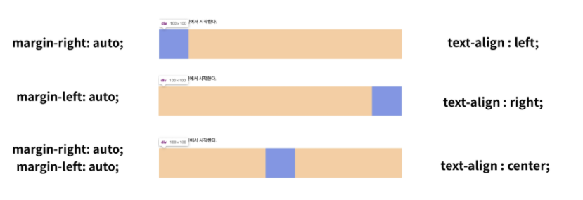
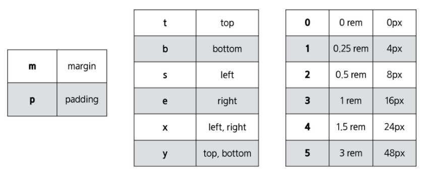
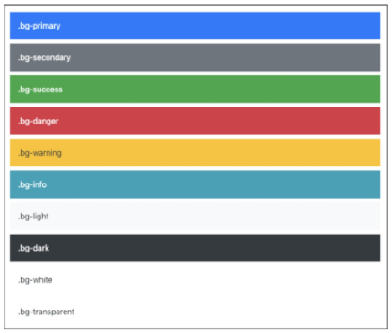

# Web

``02.01``

## 1. HTML

:memo: 현재의 웹 표준

> W3C(HTML5) vs WHATWG(HTML Living Standard)
>
> - WHATWG 주도권 싸움 승리 ! - (Apple, Google, Microsoft, Mozilla)
> - 하나로 합쳐짐
> - HTTP(Hyper Text Transfer Protocol)


: Hyper Text Markup Language

1. Hyper Text : 정보가 동일 선상이 아니라 다중으로 연결되어 있음 
   - 1 - 2, 2 - 3이 아니라 1 - 3으로도 가능!
   - 선형적인 텍스트가 아닌 비선형적인 텍스트

2. Markup Language : 태그 등을 이용하여 문서나 데이터의 구조를 명시하는 언어

   - 프로그래밍 언어와는 다르게 단순하게 데이터만 표현
   - ex) HTML, Markdown

   

   => 웹 페이지를 작성하기 위한(구조를 잡기 위한) 언어

   => 웹 컨텐츠의 의미와 구조를 정의

   

### html 요소

- HTML문서의 최상위 요소로 문서의 root를 말한다.
- head와 body로 구분


### head 요소

- 문서에 대한 정보를 담고 있으면 브라우저에 나타나지 않음
- ex) 문서  제목, CSS선언, 외부 로딩 파일 지정 등


### body 요소

- 브라우저 화면에 나타나는 정보, 실제 내용(데이터)


### DOM 트리

- Document Object Model
- 부모, 형제 관계

- 들여쓰기 표현!


### 요소(element)

- 여는/시작 태그와 닫는/종료 태그로 구성
- HTML의 요소는 태그와 내용으로 구성


### 속성(attribute)

- 태그별로 사용할 수 있는 속성은 다름


### 시맨틱 태그(Sementic Tag)

- 개발자 및 사용자 뿐만 아니라 검색엔진 등에 의미있는 정보의 그룹을 태그로 표현
- 단순히 구역을 나누는 것 뿐만 아니라 '의미'를 가지는 태그들을 활용하기 위한 노력
- Non sementic 요소 : div, span 등
- h1, table 태그들도 시맨틱 태그로 볼 수 있음
- 검색엔진최적화(SEO)를 위해서 메타태그, 시맨틱 태그 등을 통한 마크업 필요! 

> - header : 문서 전체나 섹션의 헤더(머릿말 부분)
> - nav : 네비게이션
> - aside : 사이드에 위치한 공간, 메인 콘텐츠와 관련성이 적은 콘텐츠
> - section : 문서의 일반적인 구분, 컨텐츠의 그룹을 표현
> - article : 문서, 페이지, 사이트 안에서 독립적으로 구분되는 영역
> - footer : 문서 전체나 섹션의 푸터(마지막 부분)

- 의미가 명확해지고 읽기가 쉬워짐

#### 시맨틱 웹

- 웹 상에 존재하는 수많은 웹 페이지들에 메타데이터를 부여하여, 기존의 단순한 데이터의 집합이었던 웹페이지를 '의미'와 '관련성'을 가지는 거대한 데이터 베이스로 구축하고자 하는 발상


### 문서 구조화

- 인라인 / 블록 요소
- 그룹 컨텐츠
  - ``<p>, <hr>, <ol>, <ul>, <div>`` 등
  - hr : 구분선
- 텍스트 관련 요소
  - ``<a>, <b> / <strong>, <i> vs <em>, <span>, <br>, `` 등
  - b : 그냥 굵게, strong : 굵게 + 의미 강조(시멘틱 요소)
  - i : 기울임, em : 기울임 + 추가적인 의미
  - br : 줄바꿈
  - img : 이미지 태그
- table
  
  - ``<tr>, <td>, <th>, <thead>, <tbody>, <tfoot>, <caption>`` 등
- form
  - 서버에서 처리될 데이터를 제공하는 역할
  - 기본 속성 : action, method
  - ex) 주소창에 www.naver.com를 치면 데이터가 나(브라우저)에 도착, 데이터를 naver.com에 보내줘야 하는 일이 있을 때 form을 사용

- input

  - form에서 사용하는 태그
  - 다양한 타입을 가지는 입력 데이터 필드
  - ``<label>`` : 서식 입력 요소의 캡션
    - 이름을 기재해주세요를 눌러도 입력창으로 감
  - 공통 속성 : name, placeholder, requited, autofocus
    - autofocus : 웹 사이트 접속하자 마자 그 위치로 포커싱(input란에 쓰면 입력칸에 포커싱)
  - 요소의 동작은 type에 따라 달라지므로 내용 숙지 필요!

  

## 2. CSS

: Cascading Style Sheets

- 스타일, 레이아웃 등을 통해 문서(HTML)를 표시하는 방법을 지정하는 언어
- html과 css는 각각의 문법을 가지는 별개
- html은 css 없이도 가능하지만 css는 html 없이 불가능!


### 정의 방법

1. 인라인(inline)
2. 내부참조(embedding) - ``<style>``
3. 외부 참조(link file) - 분리된 CSS 파일


### 선택자(Selector)

: 특정한 요소를 선택하여 스타일링

- 기본 선택자
  - 전체 선택자, 요소 선택자
  - 클래스 선택자, 아이디 선택자, 속성 선택자
- 결합자(Combinators)
  - 자손 결합자, 자식 결합자
  - 일반 형제, 인접 형제 결합자
- 의사 클래스/요소(pseudo class)


### CSS 적용 우선 순위(cascading order)

- 중요도(important)
  - !important
  - 사용시 주의 - cascading order를 무시하기 때문에.
  - 디버깅시 힘들 수 있어서 특별한 경우가 아니면 사용 x
  - css의 정상적인 흐름을 막음
- 우선 순위(Specificity)
  - 인라인 / id 선택자 / class 선택자 / 요소 선택자 / 소스 순서
  - 개발할 때 되도록 class만 쓰는 것 권장, class끼리 코드 순서만 봐서 이해


## CSS 상속

- 상속을 통해 부모 요소의 속성을 자식에게 상속
  - 속성 중에는 상속이 되는 것과 되지 않는 것들이 있음
  - 상속 
    - Text 관련 요소(font, color, text-align), opacity, visibility 등
  - 상속x 
    - Box model 관련 요소(width, height, margin, padding, border, box-sizing, display)
    - position 관련 요소(position, top, right, bottom, left, z-index) 등


### CSS 단위

#### 1. (상대) 크기 단위

- px(픽셀)
  - 디바이스에 따라 다를 수 있음
- %
- em
  - 배수 단위, 요소에 지정된 사이즈에 상대적인 사이즈
  - 부모 사이즈에 영향을 받음
- rem
  - 최상위 요소(html)의 사이즈를 기준으로 배수 단위
  - html의 root 글꼴 크기는 16px(기본)
- Viewport 기준 단위
  - vw, vh, vmin, vmax

#### 2. 색상 단위

- 색상 키워드
- RGB 색상
  - #+16진수 표기법
  - rgb() 함수형 표기법
- HSL 색상
  - 색상, 채도, 명도

#### 3. 문서 표현

- 텍스트
  - 변형 서체 (``<b>, <i> vs <strong>, <em>``)
- 컬러(color), 배경(background-image, background-color)
- 목록 꾸미기


### CSS Box model - 중요

: 네모를 잘 치고 시작해야함!

- Content
  - 글이나 이미지 등 요소의 실제 내용
- Padding
  - 테두리 안쪽의 내부 여백 요소에 적용된 배경색, 이미지는 padding까지 적용
- Border
  - 테두리 영역
- Margin
  - 테두리 바깥의 외부 여백, 배경색을 지정할 수 없음

#### 1. 구성(margin, padding)

- shorthand를 통해서 표현 가능!
  - 상하좌우 / 상하,좌우 / 상,좌우,하 / 상,우,하,좌(시계방향)

#### 2. 구성(border)

- shorthand 표현 가능
  - border : 2px dashed black; (width, style, color)

#### 3. Box -sizing

- 기본적으로 모든 요소의 box-sizing은 content-box
  - padding을 제외한 순수 contents 영역만을 box로 지정
- 우리가 일반적으로 영역을 볼 때, border까지의 너비를 100px 보는 것을 원한다면?
  - box-sizing을 border-box로 설정!

#### 4. 마진 상쇄(Margin collapsing)

- 인접 형제 요소 간의 margin이 겹쳐서 보임
- 블록이 top, bottom일 경우 나옴

#### 5. 기타 정보

- inline 요소는 4px의 margin이 생김
- img tag는 기본적으로 inline 요소


### CSS Display

: HTML 요소들을 시각적으로 어떻게 보여줄지 결정하는 속성

- display: block
  - 줄 바꿈이 일어나는 요소
  - 화면 크기 전체의 가로 폭을 차지(부모 넓이와 높이 전체를 차지)
  - 텍스트가 끝나도 영역이 끝나지 않고 전부를 가짐
  - 블록 레벨 요소 안에 인라인 레벨 요소가 들어갈 수 있음
  - ex) div, ul, ol, li, p, hr, form 등
  - 기본은 넓이의 100%!
- display: inline
  - 줄 바꿈이 일어나지 않는 행의 일부 요소
  - content 너비만큼 가로 폭을 차지(자식의 넓이와 높이 만큼만 차지)
  - width, height, margin-top, margin-bottom을 지정할 수 없음
  - 상하 여백은 line-height로 지정
  - ex) span, a, img, input, label, b, em, i, strong 등
  - 컨텐츠 영역 만큼만!
- 속성에 따른 수평 정렬



- display: inline-block
  - block과 inline 레벨 요소의 특징을 모두 갖음(부모 넓이를 전부 다 차지하지는 않음, 기본적으로는 inline의 넓이와 높이를 가지지만 변경 가능)
  - inline처럼 한 줄에 표시 가능, block처엄 width, height, margin 속성을 모두 지정 가능

- display: none
  - 해당 요소를 화면에 표시하지 않음, 공간도 사라짐
  - 이와 비슷한 visibility: hidden은 해당 요소가 공간은 차지하나 화면에 표시하지 않음


### CSS Position

: 문서 상에서 요소를 배치하는 방법을 지정

- static: 디폴트 값(기준 위치)

  - 기본적인 요소의 배치 순서에 따름(좌측 상단)
  - 부모 요소 내에서 배치될 때는 부모 요소의 위치를 기준으로 배치

- 좌표 property를 사용하여 이동 가능(음수 값도 가능)

  - relative
    - static 위치를 기준으로 이동(상대 위치)
    - 처음의 위치를 유지하고 자기가 움직임
  - absolute
    - static이 아닌 가장 가까이 있는 부모/조상 요소를 기준으로 이동(절대 위치)
    - 일반적인 흐름에서 제거돼서 따로 움직임, 자기 위치가 사라짐
  - fixed
    - 부모 요소와 관계 없이 브라우저를 기준으로 이동 (고정 위치)
    - 스크롤 시에도 항상 같은 곳에 위치
  -  absolute vs relative
    - 움직일 때 원래 있었던 자리가 비어있는지 여부
    - 비어 있음 : absolute, 비어있지 않음 : relative
  - sticky

  

:memo: 도움 되는 site

> - MDN web docs
> - Can I use
>   - 접근성에 관한 것, 어디에 쓰이는지
>   - 어느 사람들이 사용하는가에 따라 고려해야함
> - Emmet
>   - HTML & CSS 작성할 때 보다 빠른 마크업을 위해서 사용되는 오픈 소스
>   - 단축어, 약어 등을 사용
>   -  대부분 텍스트 에디터에서 지원
> - css diner : selector를 이해해야  할 수 있는 게임
> - flexbox froggy : flexbox 공부하는 사이트


:memo: 웹을 꾸며주는 3요소

> - html : 구조, 데이터를 들고 있음
> - css : 꾸며주는 일
> - js - 사용자와 상호작용, 동작


:memo: css reset

> - 브라우저마다 기본 css가 있기 때문에 다르게 보임
> - 프론트엔드 개발자는 css를 초기화(브라우저 차이를 없앰)하고 시작
> - reset 방법
>   - Reset : agreesive solution
>   - Normalize : gentle solution, 공통된 틀은 남김(최근에 많이 사용)


### 정리

- html
  - 웹 페이지가 어떻게 구조화되어 있는지 알 수 있도록 하는 마크업 언어
- css
  - 사용자에게 문서(HTML)를 표시하는 방법을 지정하는 언어


``02.03``

## CSS layout

: 웹 페이지에 포함되는 요소들을 취합하고, 그것들이 어느 위치에 놓일 것인지를 제어하는 기술

- Display
- Position
- Float
- Flexbox
- Grid

- 만들 때 Tip
  - top-down : 한 눈에 보일 때
  - bottom - up : 복잡할 때
  - 큰 박스가 하나가 있고 나머지 박스를 어떻게 배치할지, 직계 자식이 어떻게 되는지 생각 후 시작!

## Float

- 이미지 좌, 우측 주변으로 텍스트를 둘러싸는 레이아웃을 위해 도입
- 다른 요소들에도 적용해 웹 사이트 전체 레이아웃을 만드는데까지 발전했지만 현재는 많이 쓰이지 않음

- float는 block이 뜨게 하는 것이기 때문에 그 밑으로 block이 들어갈 수 있음
- 밑으로 들어가지 않게 하기위해서(레이아웃이 깨지지 않게 하기위해) clearfix를 부모 부분에 넣어줌
- ex) clearfix::after

### Float 속성

- none : 기본값
- left : 요소를 왼쪽으로 띄움
- right : 요소를 오른쪽으로 띄움


## 1. Flexbox

: CSS Flexible Box Layout

- 요소 간 공간 배분과 정렬 기능을 위한 1차원(단방향) 레이아웃
  - 요소와 축 기억!!!!
- 요소
  - Flex Container(부모 요소)
  - Flex Item(자식 요소)
- 축
  - main axis(메인축)
  - cross axis(교차축)


### Flex에 적용하는 속성

- 배치 방향 설정
  - flex-direction
- 메인축 방향 정렬
  - justify-content
- 교차축 방향 정렬
  - align-items, align-self, align-content
- 기타
  - flex-wrap, flex-flow, flex-grow, order

#### 1. flex-direction

- main-axis 방향만 바뀜
- flexbox는 단방향 레이아웃
  - row(default), row-reverse, colume, colume-reverse

#### 2. justify & align

- justify : 메인축 정렬
- align : 교차축 정렬

#### 3. content & items & self

- content : 여러줄
- items : 한줄
- self : flex item 개별 요소
- justify-content
  - flex-start, flex-end, center, space-between, space-around, space-evenly
- align-items
  - flex-start, flex-end, center, stretch, baseline
- align-content
  - flex-start, flex-end, center, stretch, space-between, space-around
- align-self
  - auto, flex-start, flex-end, center, baseline, stretch


## 2. Bootstrap

: Quickly, responsive grid system

- 기본적인 표시가 html과 다름
- 반응형 웹 사이트를 빠르게 만들 수 있음
- 프론트엔드 개발에서 자주 쓰이는 기능들을 제공
- one source → multi use
- 홈페이지 예제 참고하면서 개발!


### CDN

: Content Delivery(Distribution) Network

- 컨텐츠(CSS, JS, Image, Text 등)을 효율적으로 전달하기 위해 여러 노드에 가진 네트워크에 데이터를 제공하는 시스템
- 개별 end-user의 가까운 서버를 통해 빠르게 전달 가능(지리적 이점)
- 외부 서버를 활용함으로써 본인 서버의 부하가 적어짐
- 다시 불러올 때 속도가 빠름


### spacing

- html의 root 글꼴 크기는 16px
- mx-auto : 수평 중앙 정렬



### color




### Flexbox in Bootstrap

- 같은 뜻을 가진 용어 찾아서 적기!


### Responsive Web Design

- 다양한 화면 크기를 가진 디바이스들이 등장하여 RWD 개념이 등장
- 각기 다른 디바이스에서 웹 페이지를 볼 때 레이아웃이 바뀜

- 별도의 기술 이름이 아닌 웹 디자인에 대한 접근 방식, 반응형 레이아웃 작성에 도움이 되는 사례들의 모음 등을 기술하는데 사용되는 용어
- ex) Flexbox, Bootstrap Grid System, Media Queries, The viewport meta tag


### Bootstrap - Grid System

- flexbox로 제작됨

- container, rows, column으로 컨텐츠를 배치하고 정렬!

  ```html
  <div class="container">
    <div class="row">
      <div class="col-md-3"></div>
    </div>
  </div>
  ```

  

- 반드시 2가지 기억!!
  - 12개의 column
  - 6개의 grid breakpoints(xs, sm, md, lg, xl, xxl), 표를 확인

- CSS Grid와 Bootstrap Grid System은 완전히 다름

- flexbox의 대체재가 아니라 상황에 따라서 적절하게 섞어서 사용해야함


:memo: font, icon

> - 폰트 검색(fonts.google.com)
>   - select this style 누르면 오른쪽에 주소가 나오고 (CDN)복사 후 title 밑에 붙여줌
>   - &family=을 통해 여러개를 불러올 수 있음
>   - 가독성을 위해 중요!
> - fontawesome.com
>   - 다양한 아이콘 사용 가능
>   - 무료 / 유료가 있음
>   - 처음 사용할 때 : 이메일을 적으면 cdn 주소가 오고 그것을 적고 사용


:memo: form-aria-describedby

> - 접근성을 높이는 것(몸이 불편한 사람들)
> - ex) image - alt : 그림을 못보는 사람들에게 도움을 줌
> - 네이버 NULI를 가면 체험 가능


``02.07``

### em / rem 차이

- em : 상위 요소 크기의 배수

- rem : 문서의 최상단 즉, html 요소 크기의 배수

  ```html
  <!DOCTYPE html>
  <html lang="en">
  <head>
    <meta charset="UTF-8">
    <meta http-equiv="X-UA-Compatible" content="IE=edge">
    <meta name="viewport" content="width=device-width, initial-scale=1.0">
    <title>Document</title>
    <style>
      html {
        font-size: 16px;
      }
      body {
        font-size: 1.5em;
      }
      .a {
        font-size: 2.0em;
      }
      .b {
        font-size: 2.0 rem;
      }
    </style>
  </head>
  <body>
    <p class="a">Hello, World</p>
    <!-- 48px -->
    <p class="b">Hello, World</p>
    <!-- 32px -->
  </body>
  </html>
  ```


### 자손 / 자식 결합자

- 자손 : 자식, 손자 등 모든 후손 가르킨다. - div p

- 자식 : 본인의 자식만을 가르킨다. - div > p

  ```html
  <!DOCTYPE html>
  <html lang="en">
  <head>
    <meta charset="UTF-8">
    <meta name="viewport" content="width=device-width, initial-scale=1.0">
    <title>Document</title>
    <style>
      div p {
        color: blue;
      }
      div > p {
        color: crimson;
      }
    </style>
  </head>
  <body>
    <div>
      <p>안녕하세요 1</p>
      <!-- 빨 -->
        <p>안녕하세요 2</p>
        <!-- 빨 -->
      <span><p>안녕하세요 3</p></span>
      <!-- 파 -->
      <p>안녕하세요 4</p>
      <!-- 빨 -->
      <div>
        <p>안녕하세요 5</p>
        <!-- 빨 -->
        <h2>안녕하세요 6</h2>
        <!-- 검 -->
      </div>
    </div>
    <p>안녕하세요 7</p>
    <!-- 검 -->
  </body>
  </html>
  ```

- ``<span>`` 부분을 보면 자손이지만 자식이 아님을 알 수 있다.

- `<div>` 밖이나 ``<h2>``의 부분은 영향을 받지 않는다.


### Flexbox / Bootstrap

| Flexbox                        | Bootstrap                      |
| ------------------------------ | ------------------------------ |
| flex-direction: row            | d-flex flex-row                |
| flex-direction: row-reverse    | d-flex flex-row-reverse        |
| flex-direction: column         | d-flex flex-column             |
| flex-direction: column-reverse | d-flex flex-column-reversse    |
| justify-content: flex-start    | d-flex justify-content-start   |
| justify-content: flex-end      | d-flex justify-content-end     |
| justify-content: center        | d-flex justify-content-center  |
| justify-content: space-between | d-flex justify-content-between |
| justify-content: space-around  | d-flex justify-content-around  |
| justify-content: space-evenly  | d-flex justify-content-evenly  |
| align-items: flex-start        | d-flex align-items-start       |
| align-items: flex-end          | d-flex align-items-end         |
| align-items: center            | d-flex align-items-center      |
| align-items: baseline          | d-flex align-items-baseline    |
| align-items: stretch           | d-flex align-items-stretch     |
| align-self: flex-start         | align-self-start               |
| align-self: flex-end           | align-self-end                 |
| align-self: center             | align-self-center              |
| align-self: baseline           | align-self-baseline            |
| align-self: stretch            | align-self-stretch             |
| flex-wrap: wrap                | d-flex flex-wrap               |
| flex-wrap: wrap-reverse        | d-flex flex-wrap-reverse       |
| flex-wrap: nowrap              | d-flex flex-nowrap             |
| flex-wrap: nowrap-reverse      | d-flex flex-nowrap-reverse     |
| order: 0                       | order-0                        |
| order: -1                      | order-1                        |

+ flex-flow: row wrap 이런식으로 사용


### 이미지 경로

- 절대경로

  ```html
  <a></a>
  ```

- 상대경로

  ```html
  <a></a>
  ```

- 절대경로로 작성시 업로드하거나 폴더의 위치가 변경 되었을 때 이미지를 불러올 수 없게 된다. 이를 상대경로로 하여 해결한다.


### 홈페이지 이동

- 자신이 만든 html 파일끼리 이동할 때

  만든 파일 이름이 02_home.html 이라면 href=./02_home.html

  